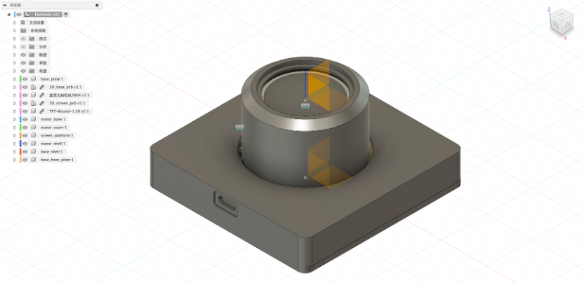
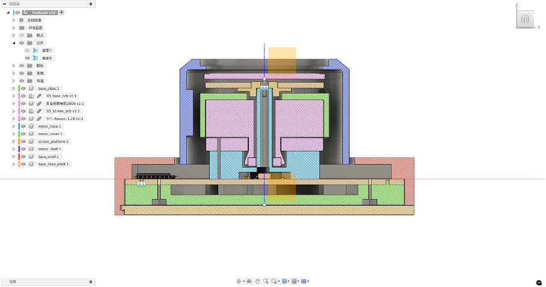
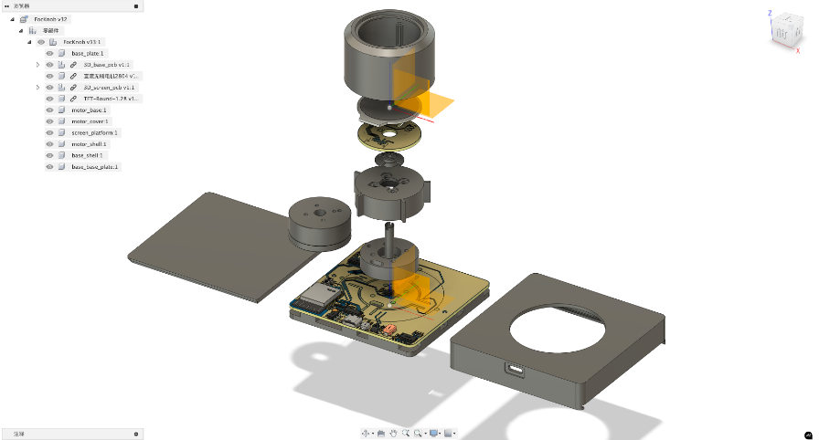
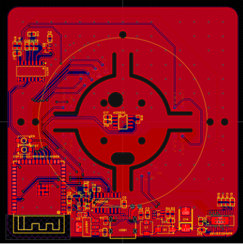
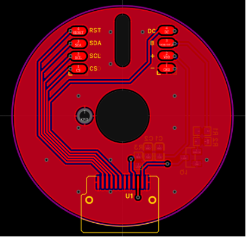
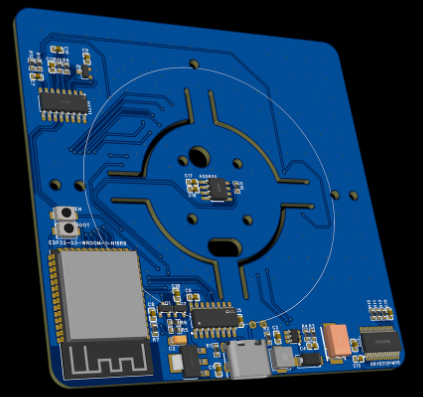
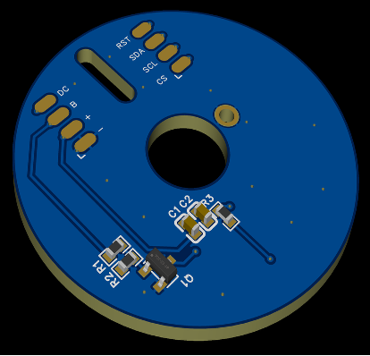

# FOC Smart Knob (基于电机触觉反馈的智能旋钮)

本项目提出并实现了一款基于 FOC（磁场定向控制）无刷电机的智能旋钮。通过实时控制电机的输出力矩，结合圆形屏幕 UI 和 MQTT
物联网通信，在单一旋钮上实现了多种传统机械旋钮的触觉反馈（如阻尼、棘轮、多档吸附等），为智能家居、车载中控等场景提供了一种可高度自定义的高级交互方案。

## 核心特性

* **多模式力反馈**：支持无极旋转、棘轮、多档开关、自适应阻尼及吸附等模式，手感可通过代码参数实时动态调整。
* **闭环控制**：ESP32-S3 主控 + AS5600 磁编码器，通过 SVPWM 算法对无刷电机进行高频精确控制。
* **按压与交互**：内置 HX711 + 压力传感器，支持按压动作识别，实现按压切换菜单等交互。
* **动态 UI 显示**：顶部集成 GC9A01 1.28寸圆形 LCD 屏幕，实时同步当前旋钮状态与物联网设备数据。
* **IoT 互联**：基于 Wi-Fi 和 MQTT 协议，实现低延迟的智能设备联动（如灯光、空调、窗帘等控制）。

## 硬件设计 (Hardware Design)

### 1. 结构与外观

外观采用极简圆柱体设计，内部包含底座、主控板、无刷电机、传动组件及顶部屏幕托盘。

|                       外观渲染                       |                       内部剖面                       |                      结构爆炸图                       |
|:------------------------------------------------:|:------------------------------------------------:|:------------------------------------------------:|
|  |  |  |

### 2. 演示视频

1. 功能演示

     - 演示旋钮在“空调温度”、“灯光亮度”、“窗帘开合”等不同模式下的 UI 联动，以及无极旋转、棘轮、边界回弹等力反馈效果。
       <video src="https://github.com/user-attachments/assets/36b64202-8c5b-4702-a256-0abc116e3df9" width="100%" controls="controls"></video>


2. 产品外观 & 离线运行演示

    <table>
      <tr>
        <th align="center"> 产品演示 (Product Demo)</th>
        <th align="center"> 离线演示 (Offline Demo)</th>
      </tr>
      <tr>
        <td width="50%" align="center">
          <video src="https://github.com/user-attachments/assets/9f6cf707-2e52-49cd-be3b-408049d534c0" width="100%" controls="controls"></video>
        </td>
        <td width="50%" align="center">
          <video src="https://github.com/user-attachments/assets/8a69e512-cf59-46dd-b751-51a924273394" width="100%" controls="controls"></video>
        </td>
      </tr>

    </table>

### 3. PCB 电路设计

包含 3.3V/12V 供电管理、ESP32-S3 最小系统、电机驱动芯片、信号采集及屏幕排线接口。

|                     主板 PCB                     |                   屏幕扩展板 PCB                    |
|:----------------------------------------------:|:----------------------------------------------:|
|  |  |

|                     主板 3D 预览                      |                    屏幕扩展板 3D 预览                    |
|:-------------------------------------------------:|:-------------------------------------------------:|
|  |  |

### 4. 注意事项

- 添加依赖库：
    ```bash
    idf.py add-dependency "lvgl/lvgl^9.2.2"
    idf.py add-dependency "espressif/esp_lcd_gc9a01^2.0.1"
    idf.py add-dependency "espressif/esp_lvgl_port^2.4.4"
    ```
- 需要开启 PSRAM 和 N16R8 需要开启 Octal Mode PSRAM